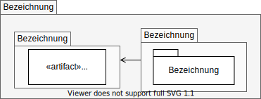
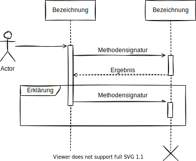

# Aufbau

Im ersten Kapitel dieses Dokuments wird zunächst erläutert was sich hinter UMLite verbirgt. Die wichtigsten Kapitel folgen darauf und sind [Wichtige Darstellungselemente](#wichtige-darstellungselemente), [Strukturdiagramme](#strukturdiagramme) und [Verhaltensdiagramme](#verhaltensdiagramme). Im letzten Kapitel wird das Ganze um Anmerkungen und Tipps erweitert, die beim Einsatz von UMLite helfen können. In jedem Kapitel werden zunächst zwingende Festlegungen beschrieben, bevor diese dann um optionale Dinge erweitert werden. Auf diese Weise sollte es möglich sein UMLite leichter in konkreten Situationen und mit unterschiedlichen Werkzeugen zu verwenden.

- [Aufbau](#aufbau)
- [Motivation](#motivation)
- [Wichtige Darstellungselemente](#wichtige-darstellungselemente)
  - [Bausteine](#bausteine)
  - [Beziehungen](#beziehungen)
  - [Kommentare](#kommentare)
- [Strukturdiagramme](#strukturdiagramme)
  - [Komponentendiagramm](#komponentendiagramm)
  - [Klassendiagramm](#klassendiagramm)
  - [Paketdiagramm](#paketdiagramm)
- [Verhaltensdiagramme](#verhaltensdiagramme)
  - [Aktivitätsdiagramm](#aktivitätsdiagramm)
  - [Sequenzdiagramm](#sequenzdiagramm)
- [Anmerkungen & Tipps](#anmerkungen--tipps)

# Motivation

Die [UML](https://de.wikipedia.org/wiki/Unified_Modeling_Language) (Unified Modeling Language) ist eine weit verbreitete grafische Modellierungssprache die von der [Object Management Group](https://www.omg.org/spec/UML/) entwickelt wurde. Sie wird von vielen Werkzeugen unterstützt und von Softwarearchitekten weltweit genutzt um Softwarestrukturen und deren interne Abläufe näher zu beschreiben. Der größte Vorteil der Sprache ist ihre Standardisierung, der größte Nachteil ihr Umfang. Man kann mit der UML Zusammenhänge sehr detailliert beschreiben, muss aber recht genau wissen wie man dabei vorgeht um nicht ggf. Verwirrung zu stiften.

Dieser beschriebene Umfang und die Komplexität wird schon sichtbar, wenn man die verschiedenen Diagrammtypen der UML betrachtet (ursprüngliche Quelle: [Wikipedia]()):

Das Ziel dieser Seite ist es, eine vereinfachte Form der UML zu beschreiben die folgende Anforderungen erfüllt:

- Sie sollte leicht verständlich und schnell zu lernen sein.
- Sie sollte ohne größeren Aufwand mit verschiedenen Zeichenwerkzeugen genutzt werden können.
- Sie sollte möglichst mit der UML kompatibel sein.

Außerdem wird darauf geachtet, dass alle Beschreibungen möglichst einfachen und damit leicht verständlich sind.

Um die Komplexität zu verringern, werden nachfolgend vorallem die Diagramme beschrieben, die am häufigsten in der Praxis anzutreffen sind oder als besonders nützlich gelten. Teilweise findet auch absichtlich eine Vermischung von Diagrammtypen der UML statt.

# Wichtige Darstellungselemente

## Bausteine

Mit UMLite wird dargestellt wie Software aufgebaut ist und wie ihre einzelnen Bausteine interagieren. Bausteine sind dabei alle Bestandteil die näher beschrieben werden sollen. Sie werden als _Rechtecke_ dargestellt. Um sie näher zu beschreiben, können Anmerkungen über dem Namen der Bausteine eingetragen werden. Diese Anmerkungen sind von spitzen Doppelklammern umgeben um sie vom Namen abzuheben.

Im Beispiel haben wir es mit unterschiedlichen Arten von Bausteinen zu tun. Es gibt beispielsweise die Kaffeemaschine, die ein komplettes System sein kann und es gibt die Komponente Brüheinheit, die in der Kaffeemaschine das Aufbrühen des Kaffees übernimmt. Nähere Erläuterungen zu den Anmerkungen und den unterschiedlichen Arten von Bausteinen finden sich im Kapitel [Strukturdiagramme](#strukturdiagramme).

## Beziehungen

**Verpflichtend**

Bausteine allein machen noch keine Software, sie müssen auch miteinander interagieren. Durch diese Interaktionen ergeben sich Beziehungen zwischen den Bestandteilen. Diese Beziehungen können unterschiedlicher Art sein:

1. Eine Beziehung die nicht näher beschrieben werden muss, nicht näher beschrieben werden kann oder bei der beide Bestandteile voneinander abhängen, wird als einfacher Strich dargestellt.
2. Ergibt sich aus der Beziehung eine direkte Abhängigkeit eines Bestandteils zu einem anderen, wird dies durch einen **Pfeil mit offener Spitze** dargestellt. Abhängigkeit bedeutet dabei, dass der Bestandteil von dem der Pfeil ausgeht den Bestandteil braucht auf den der Pfeil zeigt.
3. Die **geschlossene Spitze** ist ein Spezialfall der im Kapitel [Strukturdiagramme](#strukturdiagramme) näher erläutert wird. Er bedeutet, dass der Baustein von dem der Pfeil ausgeht spezialisierter ist, als der auf den der Pfeil zeigt. Umgekehrt ist der Baustein auf den der Pfeil zeigt damit allgemeiner formuliert als der von dem der Pfeil ausgeht.

**Funfact**: Die vielen verschiedenen Arten von Pfeilen in der UML waren einer der Gründe warum UMLite formuliert wurde.

**Optional**

In fast jedem Zeichenprogramm können unterschiedliche Linientypen verwendet werden. UMLite schreibt nicht vor ob nun eine Linie durchgezogen, gestrichelt oder gepunktet ist. Je nach Auswahl können damit aber unterschiedliche Wahrnehmungen erreicht werden. So sieht man eine durchgezogene Linie viel deutlicher als eine gestrichelte, weshalb sie allgemein als wichtiger wahrgenommen wird.

**Hinweis**: Die UMLite schreibt keine Linientyp vor. Trotzdem sollte doch darauf geachtet werden, dass beim Zeichnen immer auch ein gleiches Vorgehen genutzt wird. Daher sollte man sich bewusst entscheiden ob man nun bevorzugt gestrichelte, gepunktete oder durchgezogene Linien verwendet. Im besten Fall nutzt man einfach die Standardeinstellung des verwendeten Zeichenprogramms.

## Kommentare

**Verpflichtend**

Kommentare sind keine konkreten Bausteine, sondern erweiterte Beschreibungen. Sie sind in aller Regel gelb eingefärbt und verfügen rechts oben über eine eingeknickte Ecke. Weiterhin werden sie durch eine gerade und gestrichelte Linien mit dem Bestandteil verbunden, den sie näher beschreiben.

**Alternativ**

Nicht jedes Zeichenprogramm bietet die Möglichkeit ein Rechteck mit eingeknickter Ecke zu verwenden. Aus diesem Grund kann man auf andere Darstellungsformen ausweichen. Es bietet sich aber an, diese dann immer gelb einzufärben. Sollte man Rechtecke als Kommentare verwenden sollte die Anmerkung _Kommentar_ verwenden um Missverständnisse zu vermeiden.

# Strukturdiagramme

Strukturdiagramme zeigen wie etwas aufgebaut ist. Sie stellen also dar welche Bausteine es gibt, welche Eigenschaften diese haben und welche Beziehungen zwischen ihnen bestehen.

## Komponentendiagramm

**Grundsätzlicher Aufbau**

Komponentendiagramme werden immer dann genutzt wenn eine Struktur ohne größere Details dargestellt werden soll. Es geht bei diesen Diagrammen mehr darum die wichtigsten Bestandteile und deren Abhängigkeiten zu erklären, als ihren detaillierten Aufbau. In dem Bausteine in einem Komponentendiagramm als _Komponenten_, _Systeme_, _Subsysteme_ oder ähnliches bezeichnet werden, wird nur der Hinweis darauf gegeben, dass sie noch feinere Strukturen besitzen, die für die aktuelle Darstellung aber nicht von Bedeutung sind.

Insofern es möglich ist, kann auf die Anmerkung aber auch verzichtet werden. In diesem Fall sollte das Rechteck aber ein Symbol enthalten, die es als Komponentendarstellung kennzeichnet. Dieses Symbol besteht aus drei übereinander gelegten Rechtecken. Zusätzlich können auch die Abhängigkeiten weiter verfeinert werden, indem die Schnittstellen in _angeboten_ und _benötigt_ unterschieden werden. Angebotene Schnittstellen werden von einer Komponente zur Verfügung gestellt und können damit von anderen Komponenten genutzt werden. Benötigte Schnittstellen werden wiederum von einer Komponente gebraucht, damit diese ihre eigentliche Aufgabe erfüllen kann. Damit Schnittstellen besser wahrgenommen werden können, sollten diese außerdem über ein Quadrat, den sogenannten _Port_, auf der Seite der Komponente verfügen. Damit können sie besser von anderen Arten von Abhängigkeiten unterschieden werden.

**Beispiel mit verpflichtenden Inhalten**

Um es noch einmal zu verdeutlichen: Komponenten sind Bestandteile deren interner Aufbau nicht eindeutig definiert ist. In aller Regel handelt es sich um Bestandteile die intern in weitere Bestandteile zerlegt sein können, nach Außen aber als ein einzelner Bestandteil auftreten.

Das klingt möglicherweise etwas verwirrend und deshalb soll es am Beispiel eines Kaffeevollautomaten erklärt werden. Dieser mahlt seine Bohnen selbst, verfügt über einen Wassertank, eine Brühgruppe und eine Auffangschale für die gemahlenen Kaffeebohnen. In einem Komponentendiagramm können all diese Bestandteile als Teil des Systems "Kaffeevollautmat" dargestellt werden. Zusätzlich werden ihre Interaktionspunkte und Schnittstellen eingezeichnet. Wichtig ist hierbei, dass die Darstellung nicht zu detailliert sein sollte, weil sie sonst unübersichtlich wird und schnell altert. Daher reicht es oft schon die Rechtecke mit entsprechenden Anmerkungen wie _Component_ oder _System_ zu versehen und deren Ports über durchgezogene Linien miteinander zu verbinden.

**Beispiel mit optionalen Inhalten**

Die einfache Darstellung lässt sich zwar in jedem Zeichenprogramm darstellen, ist aber ggf. nicht eindeutig genug. Je nach verfügbarer Symbolbibliothek macht es daher Sinn, auch die Schnittstellen und deren Charakter (angeboten oder benötigt) entsprechend darzustellen. Zusätzlich sollten das Komponentensymbol verwendet werden, damit sofort ersichtlich wird, dass in diesem Diagramm bewusst Details ausgespart wurden. Möchte man dann noch darstellt, dass die Komponenten durchaus eine unterschiedliche Komplexität haben, kann diese durch entsprechende Anmerkungen dargestellt werden. Hierbei werden oft folgende Begriffe verwendet:

- _System_ - Eine sehr umfangreiche und komplexe Anordnung die alle weiteren Bestandteile enthält.
- _Subsystem_ - Ebenfalls ein recht umfangreiches Gebilde, dass aber Teil eines umfassenden Systems ist.
- _Component_ - Eine Komponente die in weitere feine Strukturen zerlegt werden kann, dabei aber nicht so komplex wie ein Subsystem oder System ist.

Es können auch weitere Begriffe genutzt werden, die aber sehr stark von den jeweiligen fachlichen und technischen Zusammenhängen bestimmt werden. Dazu zählen beispielsweise _Package_, _Module_ oder _Assembly_

Je nach darzustellenden Zusammenhängen kann es bei einem Komponentendiagramm auch Sinn ergeben, entsprechende Nutzer und Nutzergruppen einzuzeichnen um darzustellen mit welchen Bestandteilen die _Akteure_ direkt interagieren. In diesem Fall wird ein Strichmännchen verwendet.

## Klassendiagramm

**Grundsätzlicher Aufbau**

Klassendiagramme bieten eine sehr gute Möglichkeit, um das zugrunde liegende Modell eines Systems zu veranschaulichen. Es werden dabei die Abhängigkeiten der zu implementierenden Klassen mit ihren Mengenverhältnissen dargestellt. Das Klassendiagramm kann sowohl zur Veranschaulichung von domänenspezifischer Modelle, als auch auch für designspezifische Modelle genutzt werden. Je nach Ansichtspunkt wird eine leicht veränderte Notation bevorzugt, gleichwohl sind alle Notationen gleichwertig.

**Beispiel**

Während in [Komponentendiagrammen](#Komponentendiagramm) bereitgestellte und implementierte Interfaces in der so genannten [lollipop-Notation](<https://de.wikipedia.org/wiki/Schnittstelle_(UML)>) dargestellt werden, so können Details nun im Klassendiagramm betrachtet werden. In dem Beispiel ist ein weniger wichtiges, wenig detailliert beschriebenes Interface gezeigt, sowie ein Interface von größerer Bedeutung und Beschreibung mit Methoden und Eigenschaften.

Interfaces, so genannte Programmschnittstellen oder Vereinbarungen über eine bestimmte Umsetzung von Programmcode, werden immer mit den französischen Anführungszeichen, den [Guillets](https://de.wikipedia.org/wiki/Guillemets), sowie dem Schlüsselwort _interface_ gekennzeichnet. In einigen Programmiersprachen, z.B. in C#, ist es Konvention, dass Interfaces mit einem I-Präfix (Vorsilbe) beschrieben werden. Im Beispiel sieht man das an dem _IBezeichner_.

Ebenfalls als vereinbart gilt, dass Eigenschaften grundsätzlich nicht nach außen, also außerhalb der Klasse, sichtbar sind. Im Gegensatz dazu werden Methoden immer als public, also öffentlich sichtbar, angenommen.

Eine weitere Besonderheit des Klassendiagramms ist die Darstellung von Mengenverhältnissen zwischen zwei abhängigen Klassen. Zu beachten ist die Position der Mengenverhältnisse. Im Beispiel ist eine gegenseitige oder unbestimmte Abhängigkeit gegeben. Bei einer gerichteten Abhängigkeit steht das Mengenverhältnis am Pfeilende also an der Pfeilspitze.

## Paketdiagramm

Ein Paketdiagramm zeigt im einfachsten Fall die gegebenen Abhängigkeiten zwischen zwei Paketen bzw. Modulen. Jede größere Software besteht aus Klassen. Die logische oder domänenspezifische Zusammengehörigkeit von Klassen wird als Komponente bezeichnet (s. [Komponentendiagrammen](#Komponentendiagramm)).
Die Summe aller logisch zusammengehöriger Komponenten bildet ein so genanntes Modul.

Interessant für das Paketdiagramm sind vorallem Abhängigkeiten zu plattformspezifischen Systembibliotheken oder oft gebrauchte Drittparteienbibliotheken wie z.B. das beliebte Paket [Json.Net von Newtonsoft](https://www.newtonsoft.com/json), zum De- / Serialisieren von JSON-Dateien in der Programmiersprache C#, da die .Net eigene Implementierung umständlich und teilweise unzureichend ist.

# Verhaltensdiagramme

## Aktivitätsdiagramm

Das Aktivitätendiagramm besteht im Kern aus einem Anfangsknoten, einem Endknoten, sowie aus einer Folge beliebiger Knoten dazwischen. Diese Folge von Knoten repräsentiert einen geschlossenen Ablauf von Aktivitäten. Jeder einzelne Knoten ist eine Entscheidung während des Programmablaufes.

Dabei kann ein Prozess sich in mehrere Unterprozesse aufteilen (fork). Über eine Verbindung (join)
können die Unterprozesse ohne zeitliche Abhängigkeit wieder zusammengeführt werden.

Möchte man Prozesse, die zeitlich voneinander abhängen, so wählt man die Parallelisierung. Bei einer Parallelisierung starten alle parallel verlaufenden Prozesse gleichzeitig.
Als Gegenstück dazu präsentiert sich die Synchronisierung. Diese stellt sicher, dass auf jeden einzelnen parallel verlaufenden Prozess gewartet wird. Der Ablauf wird erst fortgesetzt, wenn alle Unterprozesse fertig sind.

Mit Hilfe des Aktivitätendiagramm ist es möglich, einen Arbeitsfluss abstrahiert darzustellen. Aus dieser Darstellung lässt sich anschließend eine vereinfachte Struktur für ein Programm ableiten. Die Hauptprozesse und deren Abfolge sind leicht erkennbar.

## Sequenzdiagramm

Mit Hilfe der Sequenzdiagramme werden Objekte und deren zeitliche Interaktionen dargestellt. Dabei hält jedes Objekt eine sogenannte Lebenslinie. Mit Hilfe von Nachrichten werden entlang der Lebenslinie Interaktionen der Objekte dargestellt.

Nachrichten werden als durchgezogene Pfeile, zwischen zwei Blöcken die jeweils auf einer Lebenslinie liegen, gezeichnet. Diese Nachrichten enthalten zumeist eine Methodensignatur. Wenn das Objekt ein Ergebnis zurückgibt, so wird dies mit Hilfe eines gestrichelten Pfeils dargestellt.

Mit Hilfe eines Rechtecks, sowie einer Erklärung, ist es Möglich z.B. Schleifen innerhalb einer Sequenz darzustellen. Dabei wird die Sequenz innerhalb des Rechtecks getrennt von der umschließenden Sequenz betrachtet bzw. ausgeführt.

Sehr beliebt ist das Sequenzdiagramm bei der Darstellung von Netzwerkkommunikation bzw. der Darstellung von Protokollen ([s. Beispiel TCP/IP](https://de.wikipedia.org/wiki/Transmission_Control_Protocol#Verbindungsaufbau)).

