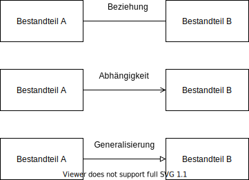

# Motivation

Die [UML](https://de.wikipedia.org/wiki/Unified_Modeling_Language) (Unified Modeling Language) ist eine weit verbreitete grafische Modellieungssprache die von der [Object Management Group](https://www.omg.org/spec/UML/) entwickelt wurde. Sie wird von vielen Werkzeugen unterstützt und von Softwarearchitekten weltweit genutzt um Softwarestrukturen und deren interne Abläufe näher zu beschreiben. Der größte Vorteil der Sprache ist dabei ihre Standartisierung, der größte Nachteil aber ihr Umfang. Demnach kann man mit der UML Dinge sehr genau und umfassend beschreiben, muss hierfür aber meist genau wissen welche Darstellungselemente welche Bedeutung haben. Dies wird aufgrund der Menge der Diagramme und ihrer Beschreibungselemente erschwert.

Ziel dieser Seite ist es deshalb, eine vereinfachte Form der UML zu beschreiben die folgende Anforderungen erfüllt:
- Sie sollte ohne größeren Aufwand mit verschiedenen Zeichenwerkzeugen genutzt werden können. Beispiele sind hierbei: Powerpoint, Paint, Visio, Draw.io usw.
- Sie sollte leicht verständlich und schnell zu lernen sein.
- Sie sollte möglichst mit der UML kompatibel sein.

Außerdem wird darauf geachtet, dass alle Beschreibungen in einer einfachen und weniger akademischen Weise verfasst sind.

# Aufbau

Der eigentliche Inhalt dieses Dokuments ist in den drei Kapiteln [Grundbausteine](#grundbausteine), [Strukturdiagramme](#strukturdiagramme) und [Verhaltensdiagramme](#verhaltensdiagramme) aufgeteilt. Demnach wird zunächst auf die wichtigsten und immer wiederkehrenden Darstellungselemente eingegangen und dann in die zwei wichtigsten Perspektiven Struktur und Verhalten unterschieden. Im letzten Kapitel wird das ganze dann noch um Anmerkungen und Tipps erweitert, die beim Einsatz von UMLight helfen können.

# Grundbausteine

# Strukturdiagramme

# Verhaltensdiagramme

# Anmerkungen & Tipps
